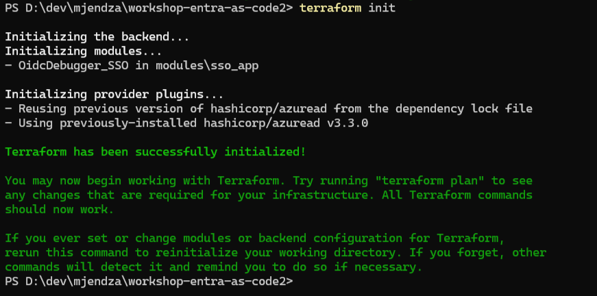
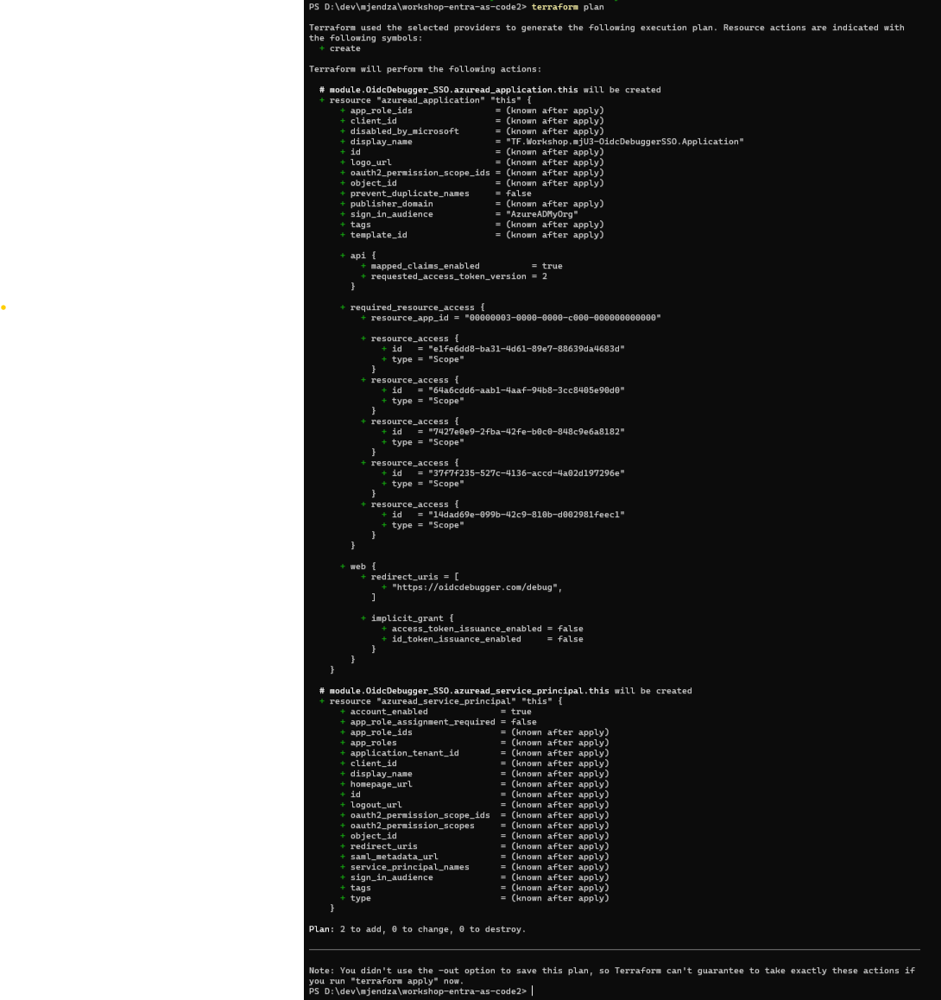
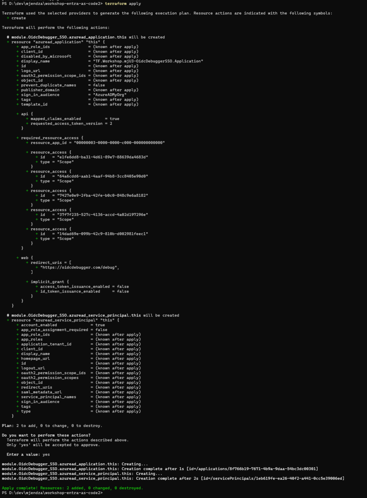
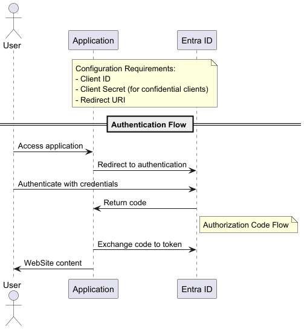
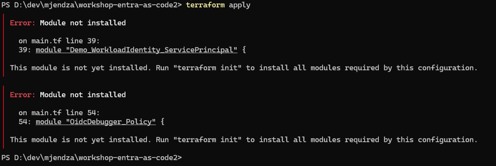

# Stage 1: SSO Application

## Why
Enabling SSO is one of the key features for Entra ID as Identity Provider. To make it simple, for the workshop we will use OIDC Debugger:
- don't need to deploy any application and code to server or run it locally
- is perfect here to test terraform, 
- is free to use
- we can test advanced scenarios like PKCE, 

## ⏱️ Estimated Time: 10-15 minutes

## Goals
- enable SSO for OIDC Debugger application with terraform (App Registration)
- generate secret for the application (manual step)

## Documentation & Links
- https://oidcdebugger.com/
- https://learn.microsoft.com/en-us/entra/identity-platform/v2-oauth2-client-creds-grant-flow#get-a-token

## Steps & code
To create the OIDC Debugger Service Principal we will use module `./modules/sso_app`. Will be simple Client Confidential application.

> **Note:** Please use unique business name for each service principal to avoid conflicts with the shared sandbox workshop tenant.

Find on the https://oidcdebugger.com/ page the redirect URI for the application (our demo) and fill the SSO instance with the URI.

``` hcl
module "OidcDebugger_SSO" {
  source = "./modules/sso_app"
  business_name = "${var.deployment_unique_name}-OidcDebuggerSSO"
  web_uri = ["PUT_YOUR_WEB_URI_HERE"]
}
```

run terraform init - to initialize terraform
``` hcl
terraform init
```
result should be similar to


```

run terraform plan - to see the changes
``` hcl
terraform plan
```
result should be similar to


run terraform apply - to apply the changes
``` hcl
terraform apply
```
result should be similar to


## Verification Steps

- two resources should be created (App Registration and Enterprise Application)
- terraform.tfstate with changes (feel free to check the file)
- .terraform directory with modules and providers
- based on the diagram test with the OIDC Debugger and VS Code `test/sso.http`

## Troubleshooting
Not initialized terraform? Error like on the screen?
run `terraform init` to initialize terraform.



---

## Stage Completion Checklist
- [ ] I have read and understood this stage
- [ ] I have added the OidcDebugger module to main.tf
- [ ] I have run `terraform init`
- [ ] I have run `terraform plan`
- [ ] I have run `terraform apply`
- [ ] I have verified App Registration in Entra ID
- [ ] I have verified Enterprise Application in Entra ID
- [ ] I have tested with OIDC Debugger
- [ ] Ready to move to the next stage

> **Tip:** Check all boxes above and close this issue when completed!

> **Report Issues:** Found a bug or have a question? [Report it here](https://github.com/mjendza/workshop-entra-as-code-interactive/issues)

---
**Navigation:** [← Previous: Stage 0](../stage-0/prerequisits.md) | [Next → Stage 2: Service Principal](../stage-2/service-principal.md)