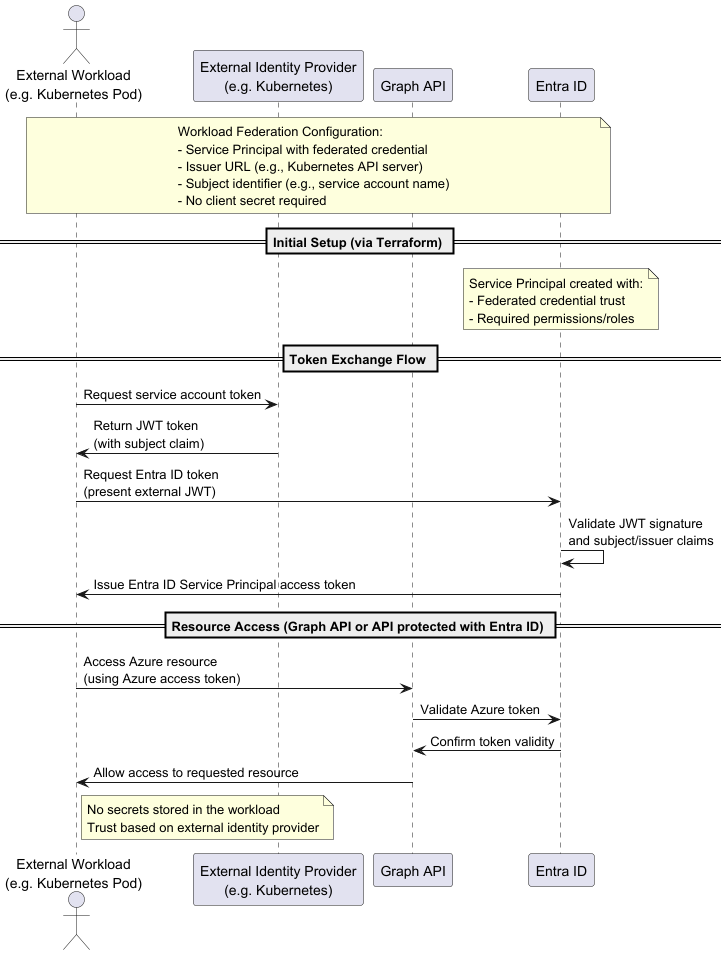
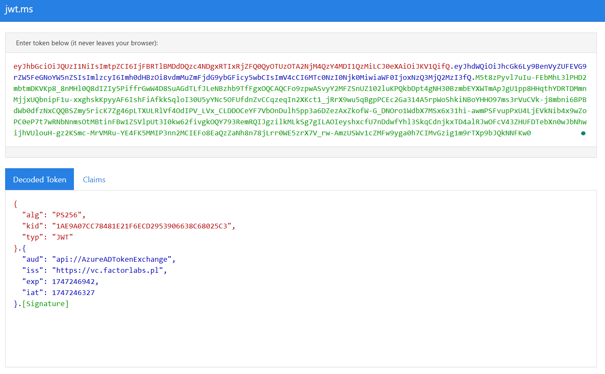

# Stage 3: Workload Federation

## Goals
- Create the Service Principal in Entra ID with terraform with Workload Identity enabled
- No secret needed.
- PUT_TOKEN_ISSUER_URL_HERE use `https://vc.factorlabs.pl`

## ⏱️ Estimated Time: 15 minutes

## Documentation
- Basic: https://learn.microsoft.com/en-us/entra/workload-id/workload-identities-overview
- https://learn.microsoft.com/en-us/entra/workload-id/workload-identity-federation
- token exchange: https://learn.microsoft.com/en-us/entra/identity-platform/v2-oauth2-client-creds-grant-flow#third-case-access-token-request-with-a-federated-credential


## Steps & code
To create the Service Principal we will use module `./modules/service_principal_workload_identity`.

> **Note:** Please use unique business name for each service principal to avoid conflicts with the shared sandbox workshop tenant.

Find needed Application.Read.All permission on the page: https://learn.microsoft.com/en-us/graph/permissions-reference

use the code below to create the Service Principal:

``` hcl
module "Demo_WorkloadIdentity_ServicePrincipal" {
  source = "./modules/service_principal_workload_identity"
  business_name = "${var.deployment_unique_name}-WorkloadIdentity"
  enable_workload_identity = true
  subject_identifier = "system:serviceaccount:default:play-with-workload-identity"
  issuer_url = "PUT_TOKEN_ISSUER_URL_HERE"
  graph_permissions = [
    #application.read.all
    "PASTE_YOUR_GRAPH_PERMISSION_GUID_HERE"
    ]
}
```

The partner token should be like on the screen


With https://jwt.ms you can decode the token and check the claims.

## Verification
- Review AppRegistration and Enterprise Application in Entra ID: check the name and permissions.
- Check if Global Admin consent is required for the selected permissions.
- Manual test: get token for 'partner' system and 'exchange' it for the Entra ID token.

## Troubleshooting
- Check if permissions is valid GUID; For the Application not Delegated permissions.
- Check if API Permission is granted for the Service Principal.

---

## Stage Completion Checklist
- [ ] I have read and understood this stage
- [ ] I have added the Workload Identity module to main.tf
- [ ] I have configured the issuer URL and subject identifier
- [ ] I have run `terraform plan`
- [ ] I have run `terraform apply`
- [ ] I have verified Workload Identity Federation in Entra ID
- [ ] I have tested the token exchange
- [ ] Ready to move to the next stage

> **Tip:** Check all boxes above and close this issue when completed!

> **Report Issues:** Found a bug or have a question? [Report it here](https://github.com/mjendza/workshop-entra-as-code-interactive/issues)

---
**Navigation:** [← Previous: Stage 2](../stage-2/service-principal.md) | [Next → Stage 4: Conditional Access](../stage-4/conditional-access.md)