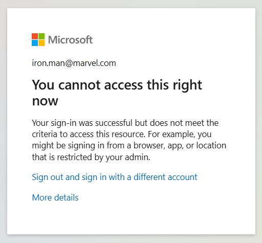

# Stage 4: Conditional Access

> **Note:** This stage requires Entra ID P1 license. Skip if not available.

## Goals
- Add Conditional Access policy to the OidcDebugger SSO application.
- Enable access only from the IP address of the workshop environment.
- Enable access only from countries in the module list.

## ⏱️ Estimated Time: 15 minutes

## Requirements
- Service Principal with: `Policy.ReadWrite.ConditionalAccess` and `Policy.Read.All` permissions.
- **Entra ID P1 license minimum** (Conditional Access is not available in Free tier).
- Security Defaults disabled in the tenant (Entra ID → Properties → Manage Security defaults → Disabled).
- OidcDebugger application registered in the tenant (from Stage 1).

> ⚠️ **Note:** If you don't have P1 license, you can skip this stage and continue with Stage 5.

## Documentation
- Basic: https://learn.microsoft.com/en-us/entra/identity/conditional-access/
- https://learn.microsoft.com/en-us/entra/identity/conditional-access/policy-block-by-location

## Steps & code
To create the Service Principal we will use module `./modules/conditional_access`.
To use one IP Address use `80.80.10.222/32`.
Link Client ID to inclue the OidcDebugger application.

``` hcl
module "OidcDebugger_Policy" {
  source = "./modules/conditional_access"
  business_name = "${var.deployment_unique_name}-EnableWorkshopForDEAndIP"
  included_applications = ["PUT_YOUR_OIDCDEBUGGER_CLIENT_ID_HERE"]
  trusted_locations_ip_ranges = ["PUT_YOUR_IP_ADDRESS_HERE_OR_ANY_OTHER_IP_ADDRESS_TO_TEST_BLOCK"]
}
```

## Verification
- Access should be blocked for us. With the provided example IP address and list of countries Conditional Access policy should block access.
- Run OidcDebugger and check if you can access the application from the IP address of the workshop environment.
- Review the Conditional Access policy in Azure Portal. Check the new Report: `Analyze Conditional Access Policy Impact` https://learn.microsoft.com/en-us/entra/identity/conditional-access/concept-conditional-access-report-only



---

## Stage Completion Checklist
- [ ] I have read and understood this stage
- [ ] I have Entra ID P1 license (or skipping this stage)
- [ ] I have disabled Security Defaults
- [ ] I have added the Conditional Access module to main.tf
- [ ] I have configured IP ranges and application ID
- [ ] I have run `terraform plan`
- [ ] I have run `terraform apply`
- [ ] I have verified the Conditional Access policy in Azure Portal
- [ ] I have tested that access is blocked as expected
- [ ] Ready to move to the next stage

> **Tip:** Check all boxes above and close this issue when completed!

> **Report Issues:** Found a bug or have a question? [Report it here](https://github.com/mjendza/workshop-entra-as-code-interactive/issues)

---
**Navigation:** [← Previous: Stage 3](../stage-3/workload-federation.md) | [Next → Stage 5: Access Package](../stage-5/access-package.md)