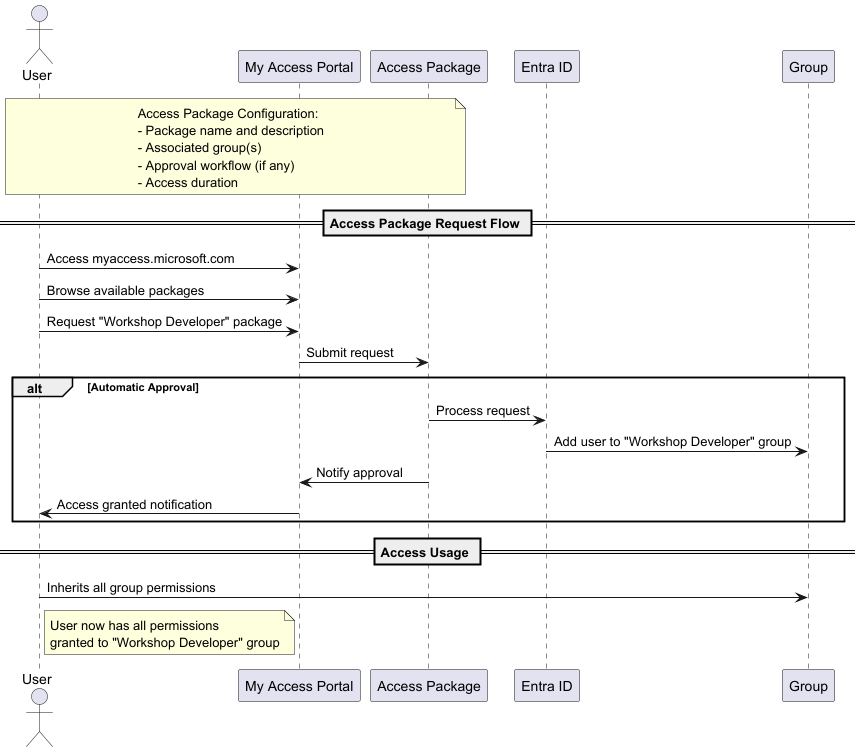
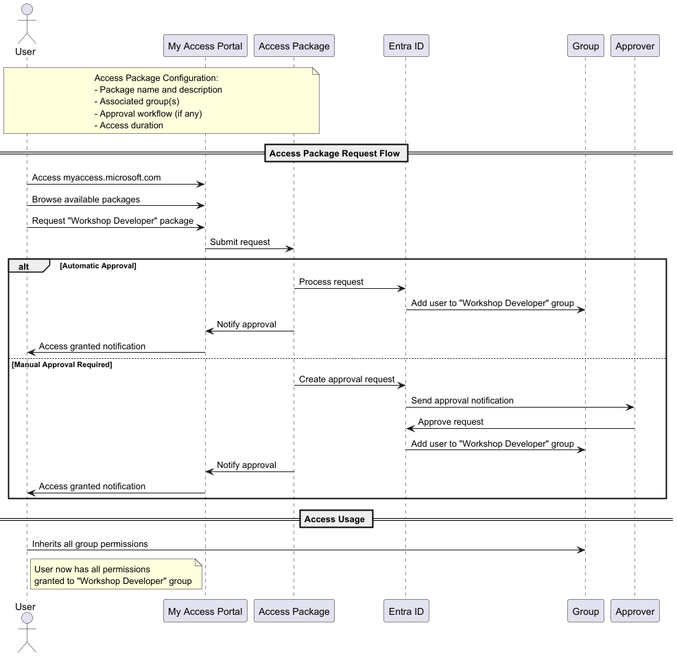

# Stage 5: Access Package

> **Note:** This stage requires Entra ID P2 or Governance license. Skip if not available.

## Goals
- With the access package we will 'onboard' the users to 'Workshop Developer' program.
- Self service action (package) will assign the user to the Entra ID group.

## ⏱️ Estimated Time: 10 minutes

## Requirements
- Service Principal with:
  - `EntitlementManagement.ReadWrite.All`
  - `Group.ReadWrite.All`
  - `Directory.ReadWrite.All`
- **Entra ID P2 license** (or Entra ID Governance license) for Access Packages.

> ⚠️ **Note:** If you don't have P2/Governance license, you can skip this stage and Stage 6.

## Documentation
- https://registry.terraform.io/providers/hashicorp/azuread/latest/docs/resources/access_package

## Steps & code


``` hcl
module "EntraDeveloper_Package" {
  source = "./modules/access_package"
  business_name = "${var.deployment_unique_name}-EntraDeveloper"
}
```

## Verification
- Your access packages https://myaccess.microsoft.com/@{{your-tenant-domain}}#/overview

## Homework
- update the module and add the minimum one approval to the access package.


---

## Stage Completion Checklist
- [ ] I have read and understood this stage
- [ ] I have Entra ID P2/Governance license (or skipping this stage)
- [ ] I have added the Access Package module to main.tf
- [ ] I have run `terraform plan`
- [ ] I have run `terraform apply`
- [ ] I have verified the Access Package in myaccess portal
- [ ] Ready to move to the next stage

> **Tip:** Check all boxes above and close this issue when completed!

> **Report Issues:** Found a bug or have a question? [Report it here](https://github.com/mjendza/workshop-entra-as-code-interactive/issues)

---
**Navigation:** [← Previous: Stage 4](../stage-4/conditional-access.md) | [Next → Stage 6: PIM](../stage-6/pim.md)