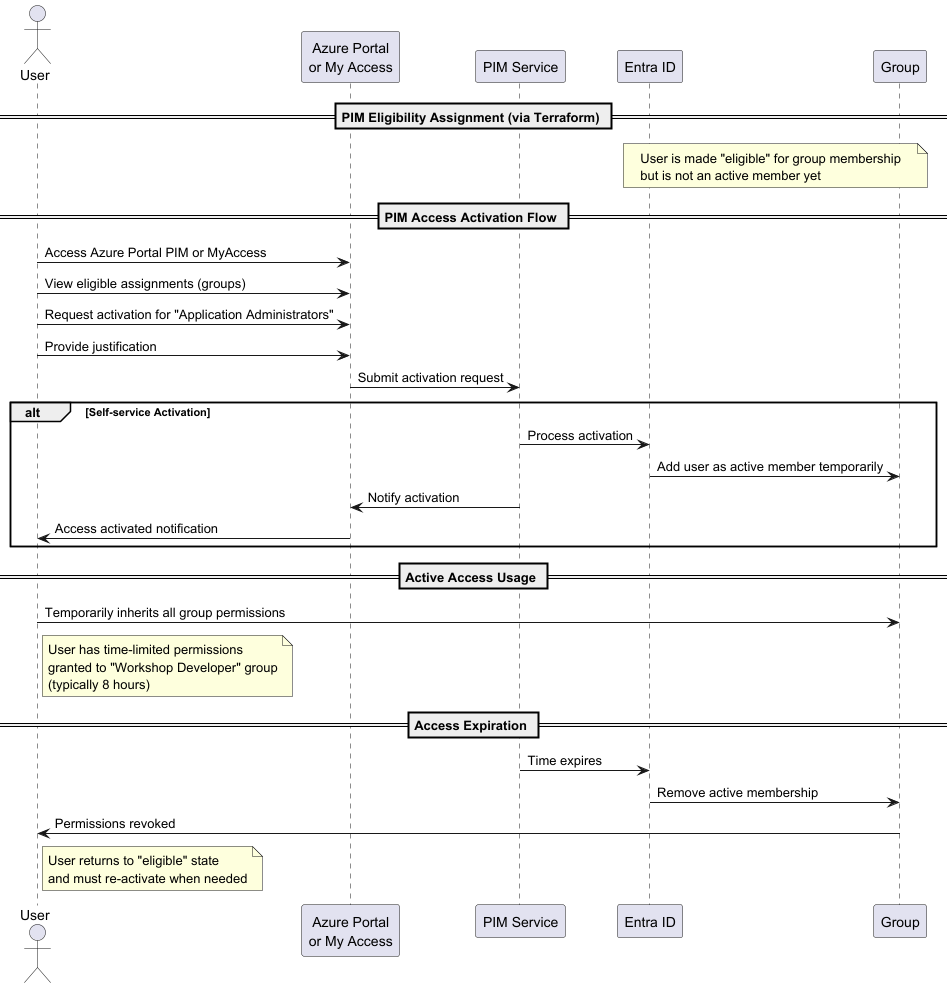
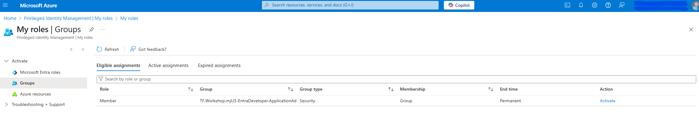

# Stage 6: PIM (Privileged Identity Management)

> **Note:** This stage requires Entra ID P2 or Governance license and completion of Stage 5.

## Goals
### Story
1. With Access Package we assign users to the 'Workshop Developer' group.
1. Now with Privileged Identity Management (PIM) we will assign the membership of the user to the next group. The new one will be 'Workshop Administrators' group.
1. As a homework we can improve the module and set high privilege access to the group.
1. As a homework we can improve the module and add the minimum one approval to the PIM activation.

## ⏱️ Estimated Time: 15 minutes

## Requirements
- Service Principal with `PrivilegedEligibilitySchedule.ReadWrite.AzureADGroup`.
- **Entra ID P2 license** (or Entra ID Governance license) for PIM.
- Completed Stage 5 (Access Package must exist first).

## Documentation
- https://registry.terraform.io/providers/hashicorp/azuread/latest/docs/resources/privileged_access_group_eligibility_schedule



## Code

``` hcl
module "EntraDeveloper_PIM" {
  source = "./modules/pim"
  business_name = "${var.deployment_unique_name}-EntraDeveloper"
  group_id_eligibility = module.EntraDeveloper_Package.group_id
}
```

## Verification
- Your access packages https://myaccess.microsoft.com/@{{your-tenant-domain}}#/overview
- Check the access via PIM in Azure Portal: https://portal.azure.com/#view/Microsoft_Azure_PIMCommon/CommonMenuBlade/~/quickStart 
- Activate the group assignment and check if the user is assigned to the group.

Activation like on the screen:


---

## Stage Completion Checklist
- [ ] I have read and understood this stage
- [ ] I have Entra ID P2/Governance license (or skipping this stage)
- [ ] I have completed Stage 5 first
- [ ] I have added the PIM module to main.tf
- [ ] I have run `terraform plan`
- [ ] I have run `terraform apply`
- [ ] I have verified PIM eligibility in Azure Portal
- [ ] I have tested activation
- [ ] Ready to move to the next stage

> **Tip:** Check all boxes above and close this issue when completed!

> **Report Issues:** Found a bug or have a question? [Report it here](https://github.com/mjendza/workshop-entra-as-code-interactive/issues)

---
**Navigation:** [← Previous: Stage 5](../stage-5/access-package.md) | [Next → Stage 7: End & Cleanup](../stage-7/end.md)